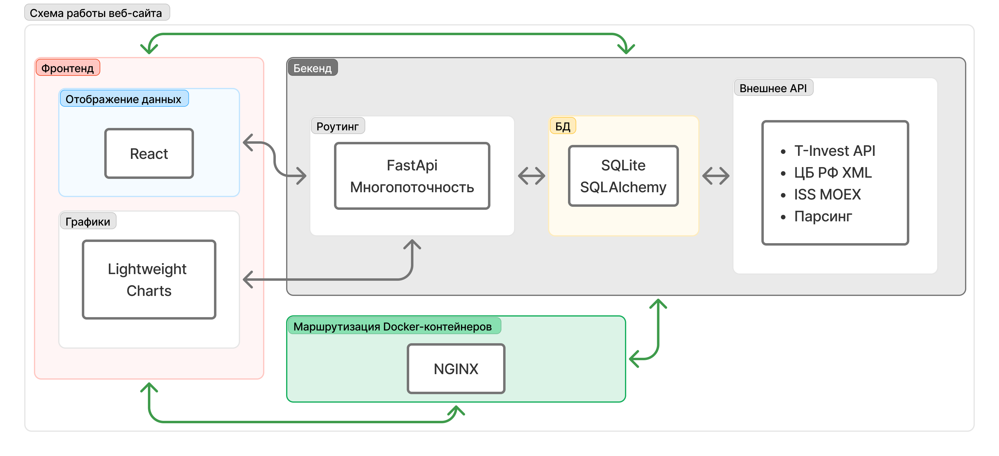
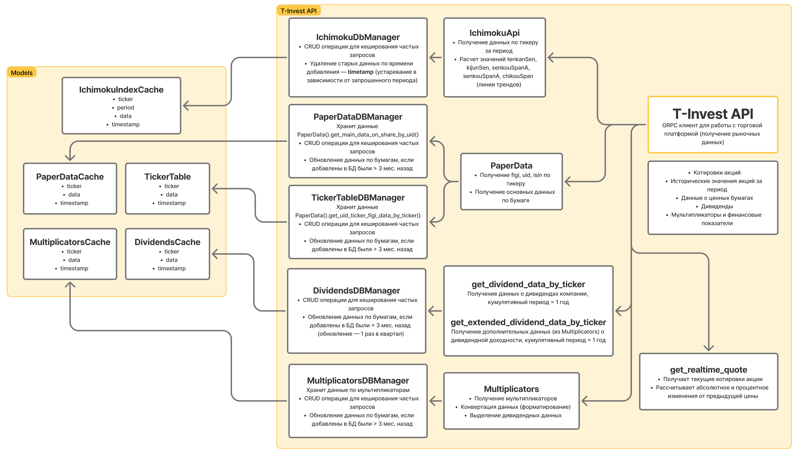
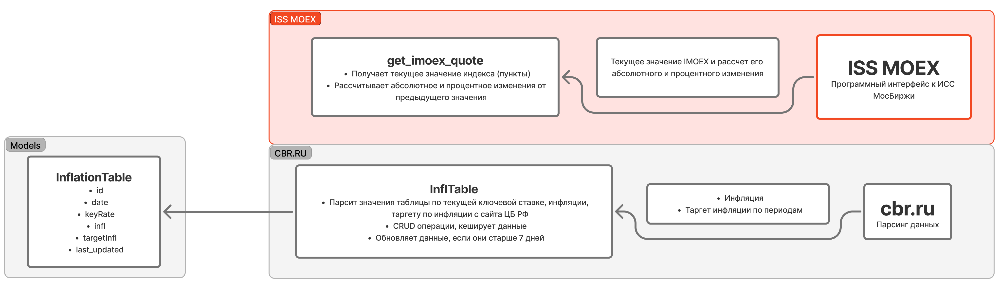
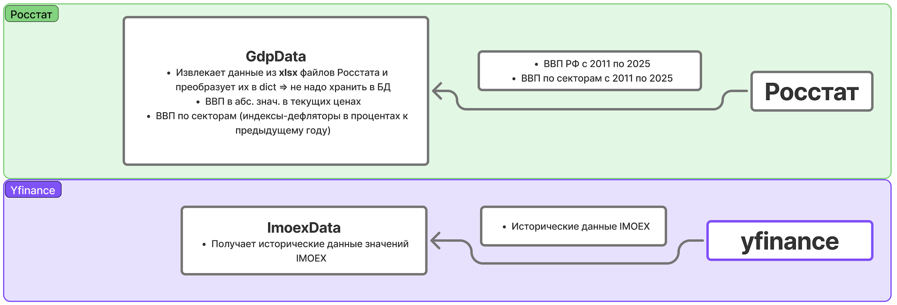
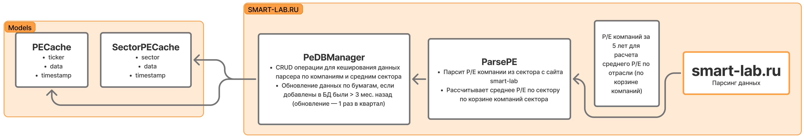
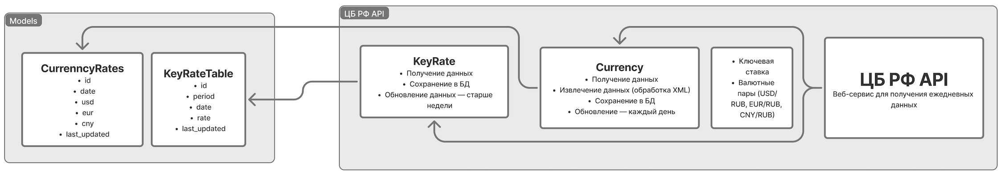
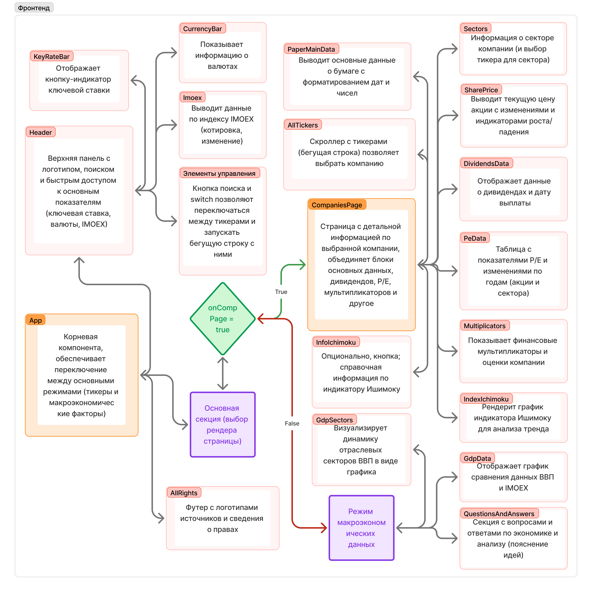
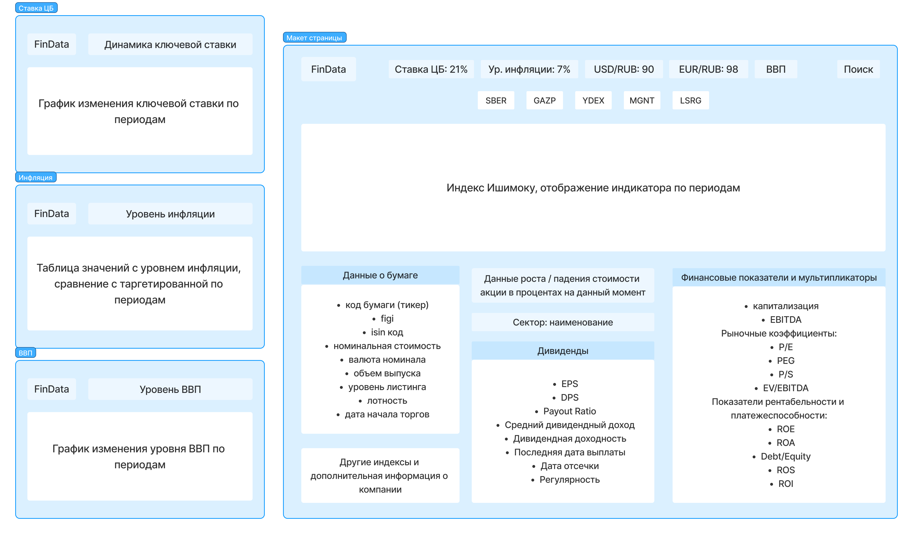
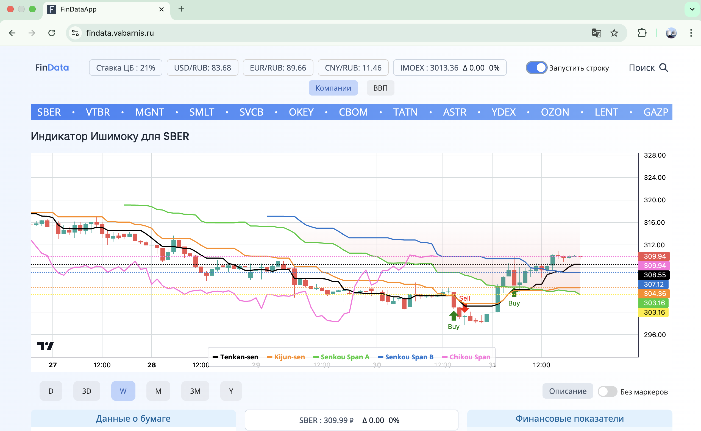

# FinData-App

HSE course project on shares data for top-5 Russian companies.

The work is related to the development of a web application for analyzing and assessing the value of Russian companies' shares. The web application integrates macroeconomic indicators: Central Bank rate, inflation rate, exchange rate, GDP level and financial indicators: stock price data, market ratios, dividend ratios. The project will be useful for assessing the real profitability of securities in the current environment.

Работа связана с разработкой веб-приложения для анализа и оценки стоимости акций российских компаний. Веб-приложение интегрирует макроэкономические показатели: ставку ЦБ, уровень инфляции, курс валют, уровень ВВП и финансовые показатели: данные о стоимости акций, рыночные коэффициенты, дивидендные коэффициенты. Проект будет полезен для оценки реальной доходности ценных бумаг в текущих условиях.

## Keywords:
Web application, macroeconomic indicators, fundamental analysis, stock market, shares of Russian companies

Веб-приложение, макроэкономические индикаторы, фундаментальный анализ, фондовый рынок, акции российских компаний

## Архитектура приложения

Схема работы приложения с основными технологиями

**Инфраструктура**:
Docker, 3 контейнера: Frontend, Backend, Nginx

Nginx для балансировки нагрузки и SSL.

**Frontend**: React (Vite) + Tailwind CSS (адаптивный интерфейс), Lightweight Charts

**Backend**: FastAPI (асинхронная обработка запросов) + SQLite (кеширование)

### Backend
Полная схема работы backend для каждого источника данных. От получения данных до добавления их в БД. 

### Frontend
Полная схема работы frontend части.

# Макет интерфейса

# Скриншоты

Приложение поддерживает кросплатформенность, удовлетворяет стандартам современной разработки.

